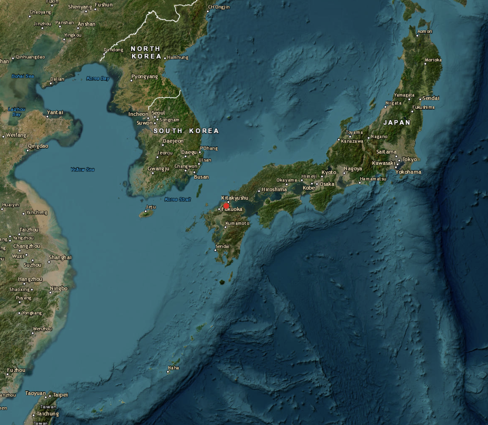

## 📂 Datensatz

Source: [*NASA Meteorite Landings Dataset*](https://data.nasa.gov/dataset/meteorite-landings)

:::::: columns
:::: {.column width="50%"}
::: {.callout-note appearance="simple"}
## Nogata

| Property           | Value          |
|--------------------|----------------|
| **Meteorite ID**   | 16988          |
| **Classification** | L6             |
| **Status**         | Valid          |
| **Mass**           | 472 g          |
| **Fall Type**      | Fell           |
| **Year**           | 860            |
| **Location**       | 33.725, 130.75 |
:::
::::

::: {.column width="50%"}

:::
::::::

------------------------------------------------------------------------

## 🎯 Projektziele

-   Anschauliche Einführung in Meteoriten für Besucher:innen\
-   Weltweite Meteoritenfunde als zeitliches Storytelling\
-   Hervorhebung besonderer Ereignisse und Funde\
-   Interaktive Visualisierungen mit Filtern und Exploration\
-   Tabletfreundliches und intuitives Design

------------------------------------------------------------------------

## Erfolgskriterien

-   Flüssige Bedienung auf Tablets\
-   Besondere Ereignisse klar erkennbar\
-   Zuverlässige Filter- und Auswahlfunktionen\
-   Vergleich von Masse, Jahr und Klassifikation möglich\
-   Übersichtliche und selbsterklärende Visualisierungen

------------------------------------------------------------------------

## 👤 Beschreibung der Zielgruppe

### Persona 1: Lucas Berger (15)

-   Sekundarschüler, Klassenausflug ins Museum
-   Kaum Vorwissen zu Meteoriten
-   Geringe Data Literacy, gewohnt an Smartphone & Social Media
-   Hauptbedürfnis: spielerische Entdeckung ohne Vorkenntnisse
-   Pain Points: zu viel Text, Fachbegriffe ohne Erklärung
-   Gains: einfache Sprache, überraschende Fakten, interaktive Bedienung

------------------------------------------------------------------------

## 👤 Beschreibung der Zielgruppe

### Persona 2: Max Schneider (31)

-   Elektroingenieur, gezielter Museumsbesuch aus Interesse
-   Grundwissen aus YouTube-Dokus und Magazinen
-   Mittlere Data Literacy, vertraut mit interaktiven Karten (Google Maps)
-   Hauptbedürfnis: verständliche Visualisierung mit Tiefe
-   Pain Points: zu wissenschaftliche Sprache, fehlende Filter
-   Gains: intuitiver 3D-Globus, Einordnung in grösseren Kontext

------------------------------------------------------------------------

## 📊 Auswahl & Begründung der Visualisierung

-   Zweiteiliges Konzept für beide Personas

    -   Zeitfaden → geführte Story für Lucas (15, ohne Vorwissen)
    -   3D-Globus → freie Exploration für Max (31, mit Interesse)

-   Narrativer Zeitfaden: 8 Ereignisse von 860 bis 2013, Karten mit Bild, Jahr, Masse, Fundort

    -   konkrete Geschichten statt abstrakter Statistik

-   Interaktiver 3D-Globus: Punkte auf drehbarer Erde, Farbe = Masse (grün, rot), optionale Heatmap

    -   vertrautes Tool (Google Maps)

------------------------------------------------------------------------

## Abschluss
Probleme & Fazit

# Danke für eure Aufmerksamkeit ☄️
