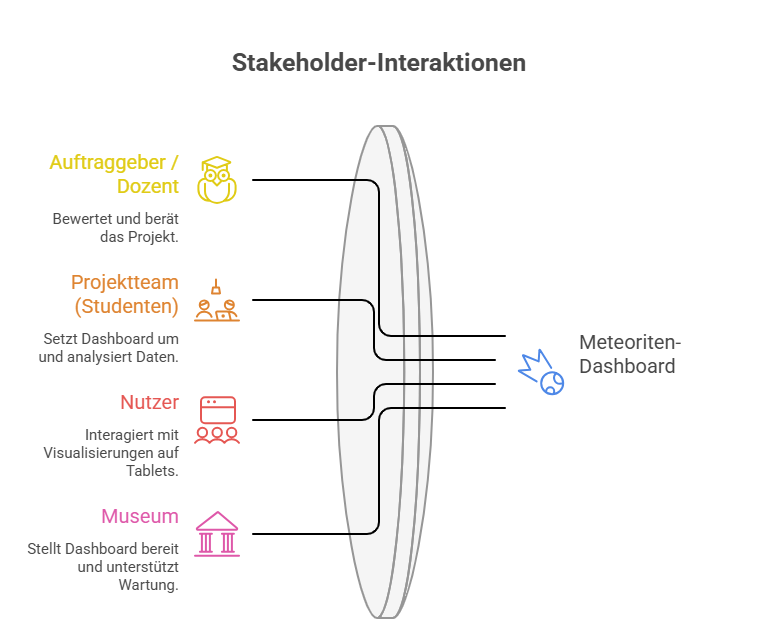

# Project Charta
## Context and Scope
Unser Projekt gehört zum geowissenschaftlichen Bereich und beschäftigt sich mit Meteoritenfunden. Ziel ist es, die wichtigsten Informationen über Meteoriten und ihre Funde weltweit anschaulich und verständlich darzustellen – speziell für den Einsatz auf Tablets in Museen. Die Zielgruppe sind Besucherinnen und Besucher ab etwa 13 Jahren, die sich im Museum erste Informationen über Meteoriten aneignen möchten.

Das Storytelling beginnt mit einer einfach verständlichen Einführung, in der grundlegende Begriffe erklärt werden. Darauf aufbauend werden mithilfe des Datensatzes bedeutende Meteoritenfunde entlang eines Zeitstrahls präsentiert. Besondere Ereignisse wie der erste dokumentierte Fund, besonders grosse oder schwere Meteoriten sowie weitere herausragende Funde werden hervorgehoben.

Am Ende des Storytellings steht eine interaktive Grafik, die es den Besucherinnen und Besuchern ermöglicht, selbst weiterführende Informationen zu entdecken. Sie können nach Jahr, Masse oder Falltyp filtern und sich zusätzlich eine Heatmap anzeigen lassen. Dadurch können die Ergebnisse direkt auf dem Tablet interaktiv erkundet werden.

Das gesamte Projekt wird als Shiny-App umgesetzt, sodass die Inhalte einfach auf Tablets im Museum zugänglich sind und die Nutzerinnen und Nutzer sowohl der linearen Storyline folgen als auch die Daten interaktiv erkunden können.


## Project Objectives and Success Criteria

### Projekziele
1. Besucherinnen und Besuchern eine anschauliche Einführung in Meteoriten bieten.
2. Wichtige Meteoritenfunde weltweit entlang eines zeitlichen Storytellings präsentieren, einschliesslich besonderer Ereignisse (z. B. erster Fund, besonders grosse Meteoriten).
3. Interaktive Visualisierungen bereitstellen, die es ermöglichen, nach Jahr, Masse, Klassifikation oder Region zu filtern und eigene Explorationen durchzuführen.
4. Inhalte intuitiv und tabletfreundlich gestalten, sodass Nutzer die Storyline linear verfolgen oder selbst Daten erkunden können.

### Erfolgskriterien(qualitativ)
1. Die Storyline und die interaktiven Elemente sind auf Tablets flüssig und intuitiv bedienbar.
2. Nutzerinnen und Nutzer können besondere Meteoritenfunde und Ereignisse klar erkennen.
3. Filter- und Auswahlfunktionen (Jahr, Masse, Falltype) arbeiten zuverlässig und liefern verständliche Ergebnisse.
4. Besucherinnen und Besucher können eigene Explorationen durchführen und Datenattribute wie Masse, Jahr oder Klassifikation direkt vergleichen.
5. Alle Visualisierungen sind übersichtlich, selbsterklärend und ermöglichen sowohl das Folgen der Storyline als auch eigenständiges Erkunden der Daten.

### Out of scope
1. Das Dashboard zeigt nur bestehende, historische Meteoritenfunde, eine Echtzeitintegration neuer Funde wird nicht umgesetzt.
2. Es werden keine Vorhersagen erstellt, z. B. zur zukünftigen Fallstelle von Meteoriten oder zu Einschlagwahrscheinlichkeiten.


## Stakeholder Analysis
Im Projekt Meteoriten-Dashboard sind vier zentrale Gruppen beteiligt: Der Auftraggeber (Dozent) bewertet das Projekt und bietet fachliche Unterstützung. Das Projektteam (Studenten) entwickelt und setzt das Dashboard um. Die Nutzer verwenden das fertige Dashboard aktiv. Das Museum stellt das Dashboard vor Ort bereit.

::: {#fig-stakeholder}
{fig-cap="Abbildung: Stakeholderanalyse"}
:::

## User Analysis

Die WebApp visualisiert gefallene Meteoriten auf einem **3D-Globus**, inklusive Heatmaps, Jahresfilter und weiteren Statistiken/Graphen.  

Es wurden zwei Zielgruppen-Personas definiert:

---

### **Persona 1: Sekundar Schüler**

**Name:** Lucas Berger  
**Alter:** 15   
**Beruf:** Sekundar Schüler      

**Domain Expertise:**  
- Sehr wenig Wissen über Meteoriten, Asteroiden und Planetologie  
- Thema wurde in der Schule noch sehr wenig behandelt

**Data Literacy:**  
- Gering, kann einfache Diagramme lesen, hat aber sehr wenig Erfahrung mit Datensätzen
- keine Erfahrung mit Statistiken, Tabellen und Datenbanken

**Technical Environment:**  
- Geräte: Smartphone, Schulcomputer
- Benutzt nur für Social Media, Gaming, und Streaming-Sites  
 
**Frequency of Use:**  
- Einmalig, Klassenausflug im Museum    

#### Customer Profile (Value Proposition Canvas)

**User Tasks (Jobs):**  
- Informationen zu Meteoriten entdecken und verstehen   
- Interaktive App ausprobieren  
 
**Social Jobs:**  
- Mit Klassenkameraden über Entdeckungen reden  

**Emotional Jobs:**  
- Neugier für das Thema Meteoriten bekommen  
- Nicht gelangweilt fühlen  

**Pains:**  
- Zu viel Text auf einmal
- Fachbegriffe ohne Erklärungen 
- Schwierigkeiten beim bedienen der Interaktiven Darstellung 

**Gains:**  
- Interessante und interaktive Visuelle Darstellung
- Einfache Sprache 
- Überaschende und interessante Fakten  

---

### **Persona 2: Interessierter Erwachsener**

**Name:** Max Schneider  
**Alter:** 31  
**Beruf:** Elektroingenieur  

**Domain Expertise:**  
- Grundwissen über Meteoriten und Astronomie  
- Interesse durch eine Youtube Doku bekommen
- Liest manchmal wissenschafts Magazine

**Data Literacy:**  
- Mittel, kann Diagramme und Grafiken lesen 
- keine Erfahrung mit wissenschaftliche Datenbanken  

**Technical Environment:**  
- Geräte: Laptop, Smartphone  
- Browserbasiert, vertraut mit interaktiven anwendungen
- Nutzt interaktive Kartenanwendungen wie Google-Maps.

**Frequency of Use:**  
- Selten, besucht das Mueseum aus persönlichen Interesse 

#### Customer Profile (Value Proposition Canvas)

**User Tasks (Jobs):**  
- Erkunden von Meteoritenfällen und deren Verteilung    
- Zusammenhänge zwischen Häufigkeit, Region und Zeit verstehen  
- Mehr Informationen zu bekannten Meteoriten finden (z.B. Chelyabinsk)  

**Social Jobs:**  
- Interessante Fakten mit Familie und Freunden teilen.      
- Mehr Gesprächstoff haben.

**Emotional Jobs:**  
- Neugier und interesse zufriedenstellen
- Motivation, mehr zu lernen  

**Pains:**  
- Zu technische oder wissenschaftliche Sprache  
- Schwierigkeit, Daten zu filtern oder zu vergleichen  
- Fachbegriffe ohne Erklärungen

**Gains:**  
- Klare, verständliche Visualisierungen  
- Spannende Informationen über einzelne Meteoriten
- Intuitiv bedienbarer 3D Globus  
- Einordnung der Daten in einen grösseren Kontext

---

### **Zusammenfassung der Personas**

| Persona | Hauptbedürfnis | Nutzungskontext |
|---|---|---|
| Lucas Berger (Sekundar Schüler) | Spielerische Entdeckung ohne Vorkenntnisse | Einmalig, Klassenausflug im Museum |
| Max Schneider (Bildungsinteressierter) | Lernen & Verständliche Visualisierung | Selten, gezielter Museumsbesuch |


## Situation Assessment
Für unsere Projektarbeit arbeiten wir mit einem Datensatz der NASA, der Daten von Meteoriteneinschlägen enthält. 
Unser Team besteht aus drei Personen. Als Software setzen wir hauptsächlich Python mit allen relevanten Zusatzpaketen ein, bei Bedarf kann weitere Software genutzt werden. Das Projekt soll bis zum 1. Juni abgeschlossen werden, wobei der Arbeitsaufwand auf die Teammitglieder verteilt und durch regelmässige Treffen koordiniert wird. Mögliche Risiken umfassen technische Probleme, Verzögerungen bei der Datenaufbereitung oder eine ungleichmässige Arbeitsverteilung im Team, welche den Zeitplan beeinflussen könnten.

## Visualization Concept
### Produktform

Das Visualisierungsprodukt ist eine Python-Shiny-Webanwendung, die sich an Besucherinnen und Besucher von einem Meteoritenmuseum richtet. Die App gliedert sich in zwei aufeinander aufbauende Teile.

Der erste Teil ist ein narrativer Zeitfaden. Er beginnt mit einem einleitenden Abschnitt, der allgemeine Informationen über Meteoriten hat. Danach führt ein Scroll-Zeitstrahl durch acht ausgewählte Ereignisse der Meteoritengeschichte, vom ersten dokumentierten Fund im Jahr 860 bis zum Einschlag von Chelyabinsk 2013. Jedes Ereignis erscheint als Karte mit Bild, Jahr, Fundstatus, Masse, Zusammensetzung und Fundort.

Der zweite Teil ist ein interaktiver 3D-Globus. Er zeigt alle ausgesuchten  Meteoriteneinschläge des NASA-Datensatzes als Punkte auf einer drehbaren Erdkugel. Hier können Besucherinnen und Besucher selbst erkunden.

### Visuelle Kodierungen

Den Kern des zweiten Teils bildet der 3D-Globus. Jeder Einschlag ist als Punkt dargestellt; die Farbe kodiert die Masse auf einer Skala von Grün (leicht) bis Rot (schwer). Ergänzt wird der Globus durch weitere Elemente, wie die Heatmap, bei dieser Heatmap werden Regionen in denen eher weniger Meteoriten gefunden worden sind als dunkelrot angezeigt und Regionen in denen viele Meteoriten gefunden worden sind hellgelb angezeigt.

Im narrativen Zeitfaden übernehmen die Ereigniskarten die visuelle Funktion. Bild und Metadaten stehen nebeneinander; ein Zeitstrahl mit Jahresmarkierungen gibt räumliche Orientierung.

### Interaktivität

Der narrative Zeitfaden reagiert auf das Scrollen. Ein Scroll-Skript erkennt, welche Karte sich in der Bildschirmmitte befindet, hebt sie hervor und blendet die anderen aus. Ein beweglicher Jahreszeiger auf dem Zeitstrahl zeigt das aktuelle Jahr an.

Der Globus verfügt über ein ein- und ausblendbares Filtermenü. Darin lassen sich der Zeitraum, die Masse, der Falltyp (gefallen oder gefunden) sowie die maximale Punktzahl und der Sampling-Modus einstellen. Beim Hovern über einen Punkt erscheint ein Tooltip mit Name, Jahr, Masse und Klasse des Meteoriten. Zusätzlich kann eine 3D-Heatmap-Schicht über den Globus gelegt werden.

### Narrative und Annotation

Jede Ereigniskarte zeigt neben dem Bild die wichtigsten Metadaten: Masse, Zusammensetzung und Fundort. Links zu Wikipedia und zur Bildquelle sind direkt in jede Karte eingebettet.

### Zielmedium und Integration

Die App läuft als öffentliche Webanwendung im Desktop-Browser. Der gesamte Code ist in einem Quarto-Projekt auf GitHub dokumentiert und reproduzierbar. Der Server verarbeitet den datensatz und Besucherinnen und Besucher müssen nichts installieren.

### Bezug zu Projektzielen und Nutzerbedürfnissen

Das Konzept adressiert zwei Projektziele: Wissensvermittlung und eigenständige Exploration.
Der narrative Zeitfaden richtet sich an Besuchende ohne Vorwissen. Kurze Ereigniskarten mit Bild, Masse und Fundort vermitteln Kontext, ohne zu überfordern. Der Scroll-Mechanismus hält alles sehr simple.
Der 3D-Globus ermöglicht eigenständiges Erkunden. Filter nach Jahr, Masse und Falltyp erlauben gezielte Fragen; die Infofelder liefern Details zu einzelnen Einschlägen.

## Project Plan

Das Projekt gliedert sich in vier Phasen: Projektinitiierung, Datenanalyse, Design und Entwicklung sowie Evaluation und Präsentation.

**Projektinitiierung** umfasst die Erstellung und Einreichung der Projektcharta. Die Phase beginnt Anfang März und endet mit der Abgabe des Charta-Entwurfs am 20. März.

**Datenanalyse** umfasst die explorative Analyse des NASA-Meteoriten-Datensatzes sowie die Erstellung des Data Reports. Die Phase läuft von März bis April.

**Design und Entwicklung** umfasst das Visualisierungsdesign sowie die Implementierung der Shiny-Website. Die Phase läuft von April bis Mai.

**Evaluation und Präsentation** umfasst die Evaluation der Ergebnisse sowie die Vorbereitung und Einreichung der Präsentation. Der Entwurf der Präsentation wird am 18. Mai eingereicht. Die finale Abgabe erfolgt am 1. Juni.

```{mermaid}
gantt
    title Projektplan
    dateFormat YYYY-MM-DD
    axisFormat %d.%m

    section Projektinitiierung
    Projektcharta erstellen         :done, 2026-03-01, 2026-03-20
    Abgabe Entwurf Projektcharta    :milestone, 2026-03-20, 0d

    section Datenanalyse
    Datensatz erkunden              :done, 2026-03-20, 2026-04-10
    Data Report erstellen           :done, 2026-04-01, 2026-04-20

    section Design und Entwicklung
    Visualisierungsdesign           :active, 2026-04-10, 2026-04-30
    Website erstellen               :active, 2026-04-20, 2026-05-18

    section Evaluation und Präsentation
    Evaluation                      :2026-05-01, 2026-05-18
    Abgabe Entwurf Präsentation     :milestone, 2026-05-18, 0d
    Präsentation vorbereiten        :2026-05-18, 2026-06-01
    Finale Abgabe                   :milestone, 2026-06-01, 0d
```


## Roles and Contact Details

| Name | Role | Mail |
|---|---|---|
| Andreas Minder | Developer |mindeand@students.zhaw.ch|
| Nico Varano | Developer | varannic.studnets.zhaw.ch |
| Silvan Dubach | Developer | dubacsil@students.zhaw.ch |

